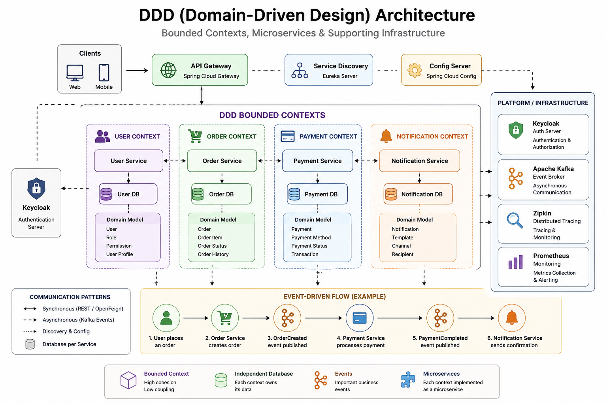
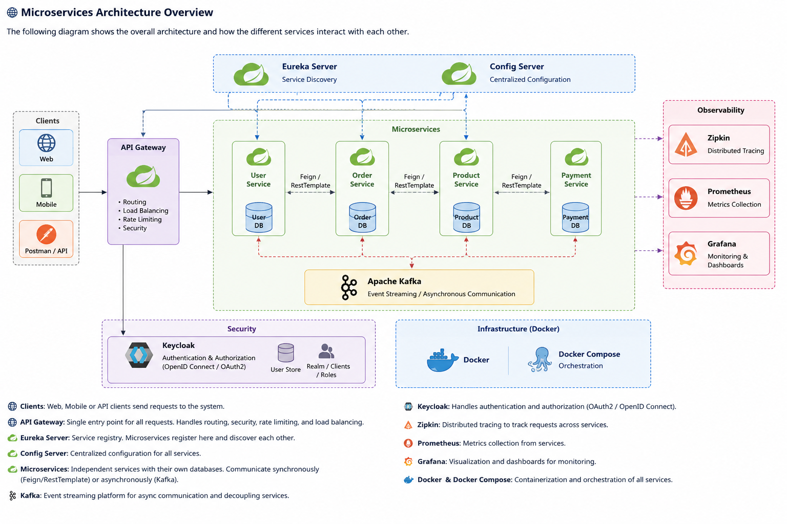

# 🚀 Microservices with Spring Boot & Spring Cloud

A hands-on project to learn and practice modern **microservice architecture** using Spring ecosystem tools.

---

## ✨ Overview

This project demonstrates how to design and implement a distributed system using real-world microservice patterns.

You will explore communication styles, infrastructure setup, security, and observability in a fully containerized environment.

---

## 🧩 Key Features

### ⚙️ Core Microservices Patterns
- 📦 Centralized Configuration Server
- 🔍 Service Discovery with Eureka
- 🌐 API Gateway

### 🔄 Communication
- ⚡ Asynchronous messaging with Kafka
- 🔗 Synchronous communication using OpenFeign & RestTemplate

### 📊 Observability
- 📍 Distributed tracing with Zipkin
- 📈 Monitoring with Spring Boot Actuator

### 🔐 Security
- 🛡️ Authentication & Authorization using Keycloak

### 🐳 Infrastructure
- 🐳 Dockerized services
- 🧱 Docker Compose orchestration

---

## 🛠️ Tech Stack

- Spring Boot
- Spring Cloud
- Apache Kafka
- Keycloak
- Zipkin
- Docker & Docker Compose

---

## 🎯 Goal

To understand how real-world distributed systems are built using microservices, including communication, security, scaling, and observability.

---

## 🧠 Domain-Driven Design (DDD) Overview

<p>
  
</p>

## 🧱 Architecture  Diagram

<p>
  
</p>

## 🚀 Getting Started

### 1. Clone the repository
```bash
git clone <repo-url>
cd <repo-folder>